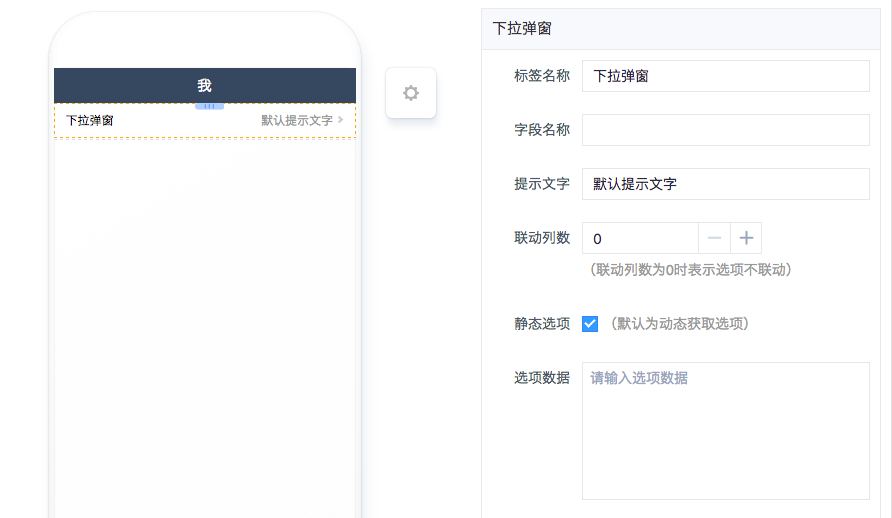
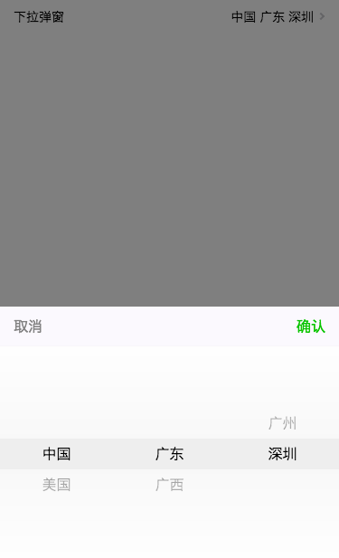

# 下拉弹窗组件
----
## 简介

### 主要功能
常用的下拉选择组件，有两种模式，联动和非联动。

### 应用场景
- 联动选择多用于具备父子关系的选项，比如省市县选择；
- 非联动选择则适用于没什么必然联系的选项，比如尺码、颜色。

### 缩略图
- 配置界面

> 

- 实际效果

> 

## 配置说明

| 配置项 | 描述 | 是否必填 | 备注 |
| :--- | :--- | :--- | :--- |
| 标签名称 | 该组件在页面上显示的名称 | 是 | 无 |
| 字段名称 | 该组件数据所指向API的字段名 | 是 | 无 |
| 提示文字 | 选项的提示内容 | 否 | 无 |
| 联动列数 | 该组件当前联动选项内容的列数，非联动则设为0 | 是 | 该配置必须与选项数据实际列数保持一致，否则会渲染失败 |
| 静态选项 | 选项内容固定不变时勾选 | 是 | 无 |
| 选项数据 | 配置为静态选项时可填 | 否 | 无 |

## 注意事项
### 组件依赖
该组件必须在[表单容器](../components-panel/form.md)中使用

### 选项数据格式
- 联动数据

```js
//name: 显示名称
//value: 选项值
//parent: 关联的父选项，第一级选项则为0
[{
        name: '中国',
        value: 'china',
        parent: 0
      }, {
        name: '美国',
        value: 'USA',
        parent: 0
      }, {
        name: '广东',
        value: 'china001',
        parent: 'china'
      }, {
        name: '广西',
        value: 'china002',
        parent: 'china'
      }, {
        name: '美国001',
        value: 'usa001',
        parent: 'USA'
      }, {
        name: '美国002',
        value: 'usa002',
        parent: 'USA'
      }, {
        name: '广州',
        value: 'gz',
        parent: 'china001'
      }, {
        name: '深圳',
        value: 'sz',
        parent: 'china001'
      }, {
        name: '广西001',
        value: 'gx001',
        parent: 'china002'
      }, {
        name: '广西002',
        value: 'gx002',
        parent: 'china002'
      }, {
        name: '美国001_001',
        value: '0003',
        parent: 'usa001'
      }, {
        name: '美国001_002',
        value: '0004',
        parent: 'usa001'
      }, {
        name: '美国002_001',
        value: '0005',
        parent: 'usa002'
      }, {
        name: '美国002_002',
        value: '0006',
        parent: 'usa002'
}]
```

- 非联动数据

```js
[
    ['小米', 'iPhone', '华为', '情怀', '三星', '其他', '不告诉你'], 
    ['小米1', 'iPhone2', '华为3', '情怀4', '三星5', '其他6', '不告诉你7']
]
```

```js
//使用 name => value 的形式
[[{
  name: '2019届5班',
  value: '1'
}, {
  name: '2019届4班',
  value: '2'
}]]
```

